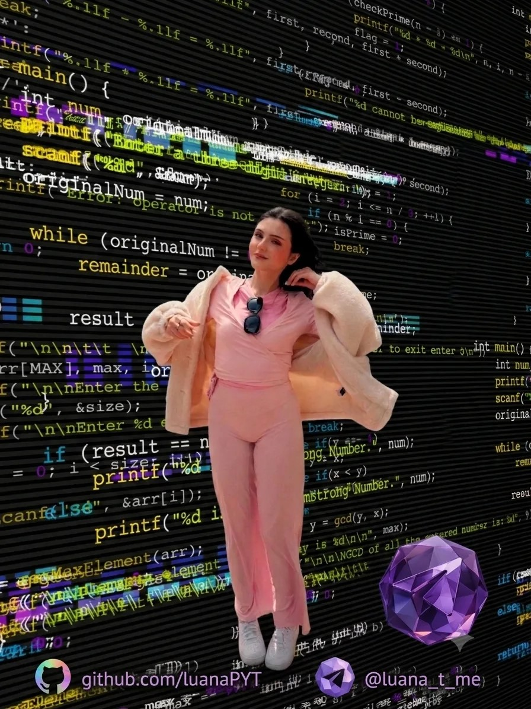

<div align="center">


</div>

<div align="center">
  
</div>

[](https://github.com/luanaPYT)

## 🌟 Identity Matrix

### 👨‍💻 Professional Nexus

```yaml
developer:
  focus: "Learning C++ and web development"
  level: "beginner — curious, persistent, improving every day"
  stack: ["C++ (learning)", "HTML", "CSS", "JavaScript"]
  mission: "Understand how things work by building them myself"

current_quests:
  - 🧠 Mastering C++ fundamentals, one exercise at a time
  - 🌐 Building my first pages with HTML & CSS
  - 🛠️ Turning tiny ideas into small working projects
  - 🤖 Keeping every repo's CI badge green

personality:
  traits: ["Problem Solver", "Curious", "Persistent"]
  motto: "Debug with coffee, deploy with confidence"
```

### 🎯 Tech DNA Sequence

```cpp
const auto luanaPYT = [] {
    struct {
        std::vector<std::string> learning    {"C++", "HTML", "CSS"};
        std::vector<std::string> exploring   {"JavaScript", "Python"};
        std::vector<std::string> domains     {"Algorithms", "Web pages", "CLI toys"};
        std::vector<std::string> tooling     {"Git", "GitHub Actions CI", "Make"};
        std::string codingStyle   = "Small steps, lots of experiments";
        std::string workingHours  = "Late nights, powered by curiosity ☕";
        bool lovesGreenCheckmarks = true;
    } me;
    return me;
}();
```

## ⚡ Tech Arsenal

<a href="https://skillicons.dev">
  
</a>

## 📊 Analytics Command Center

<div align="center">


<br/>


</div>

---

<div align="center">


*"Debug with coffee, deploy with confidence."* ☕🚀

</div>


